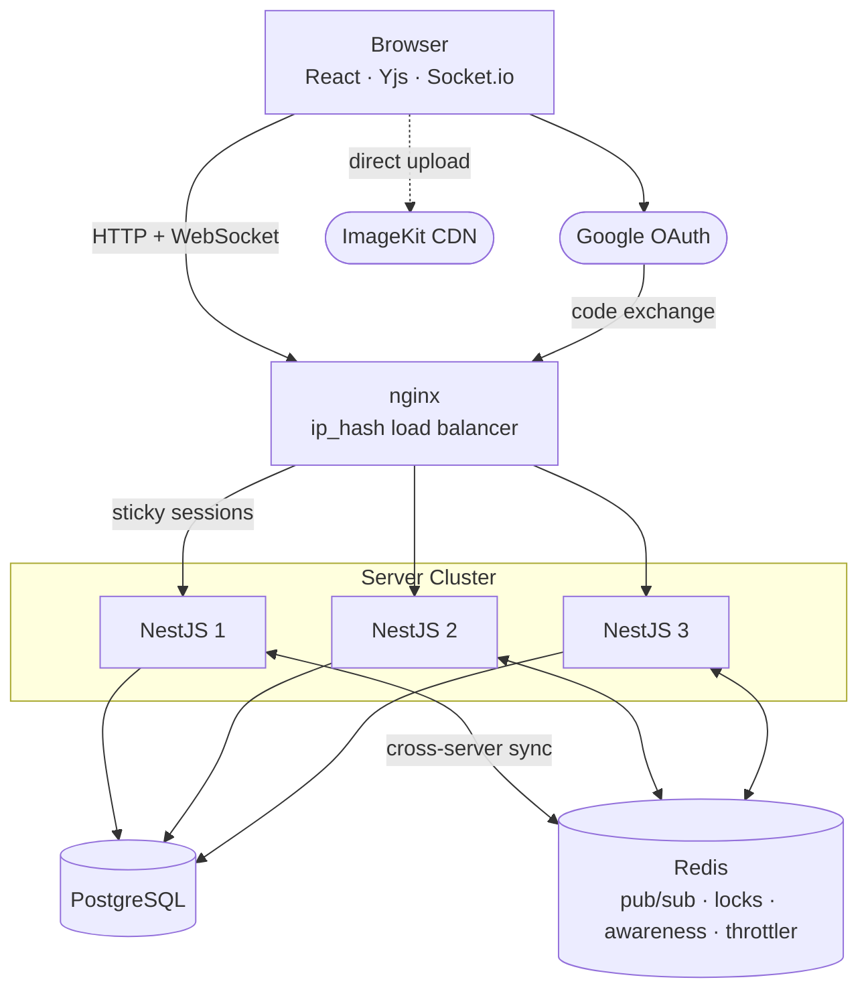

# Converge

A Notion-style editor with live collaborative editing, workspaces, and granular access control.

**Live:** [converge.1k5.in](https://converge.1k5.in) · sign in with any Google account.

https://github.com/user-attachments/assets/e74a9a3b-8cf7-4625-925d-6fce35e5bfdd

## Features

- **Collaborative editing** with live presence avatars showing who is focused on which block
- **Rich-text editor** built on BlockNote, with image, video, and audio upload support
- **Workspaces** to organize documents into shared spaces with owner, admin, and member roles
- **Granular access control** with four tiers: workspace role defaults, per-doc overrides, explicit user grants, and workspace owner
- **Document library** with full-text search, infinite scroll, and a keyboard-navigable switcher (Ctrl+P)
- **Google OAuth** with secure httpOnly cookie sessions

## Architecture

## Stack

React · NestJS · Yjs · BlockNote · PostgreSQL · Redis · Socket.io

## Docs

- [Roadmap](./ROADMAP.md)
- [Architecture](./docs/architecture-low-level.md)
